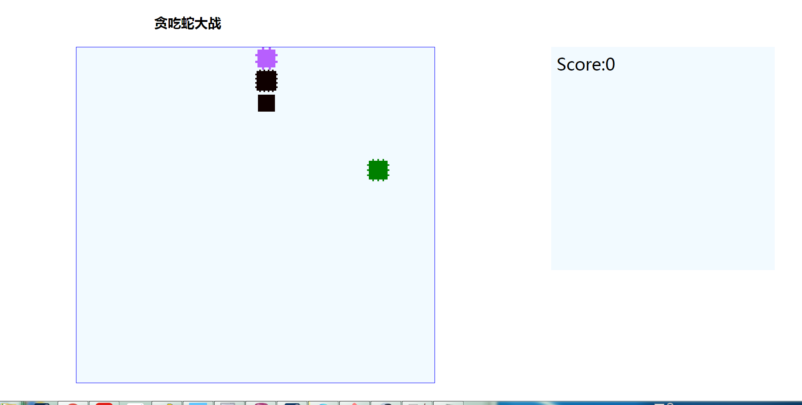

## sankes for Study jQuery and css
 Let snake move is not easy thing for me,otherwise change the class of divs dynamicly is good way to drives div move similarly.So divide the canvas into several divs that you can controll, and write interval function of jQuery to change status of divs.
* INDRODUCTION  
   press `LEFT key` or `A` key control the snake to left  
   press `RIGHT Key` or `D` key control the snake to right  
   press `DOWN Key` or `S` key control the snake to down  
   press `UP Key` or `W` key control the snake to up  

### This demo is just for fun):)

