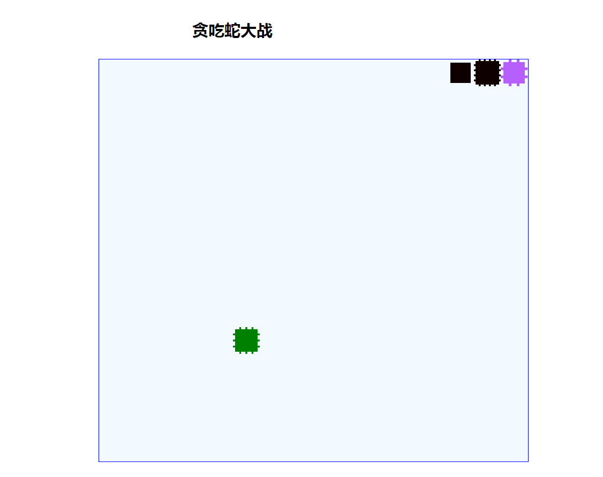

### sankes for Study jQuery and css
Let snake move is not easy thing for me,otherwise change the class of divs dynamicly 
is good way to drives div move similarly.
so divide the canvas into several divs that you can controll, and write interval 
function of jQuery to change status of divs.
  ---
  
